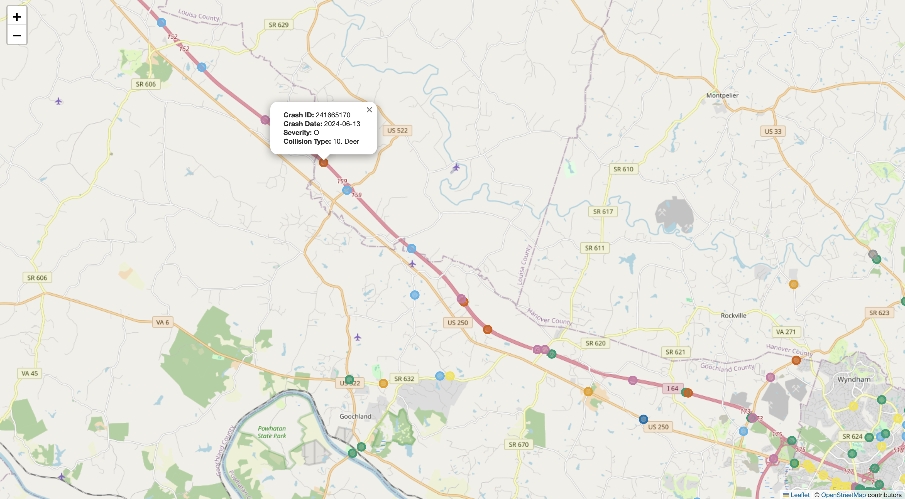

# Crash Data Visualizer
This project visualizes the most recent 10,000 car crashes in 2024 in Virginia using a Folium map. The data is fetched from a GeoJSON service, processed, and plotted with colors to differentiate crash types. Clicking on each crash marker will display a popup with basic information about the crash, such as the date, time, severity, type, etc. More detailed information is available in the data.

## 8/30 Key Improvements
- **Asynchronous Data Fetching**:
  - Enhanced efficiency by using asynchronous data fetching to handle large volumes of data. The script fetches data from the GeoJSON service in chunks using pagination, which significantly speeds up the process and improves performance.
- **PostgreSQL Integration:**:
  - **Data Storage**: Integrated PostgreSQL to store processed data efficiently. The script creates a PostgreSQL database table and inserts crash data into it. This approach ensures data handling is more secure and allows for easier querying and management of large datasets.
  - **Data Management**: Uses SQL commands to manage and manipulate data within PostgreSQL, making it possible to handle complex queries and ensure the data is well-organized.

## Features

- **Efficient Data Fetching:**:
  - Fetches car crash data asynchronously from the GeoJSON service, handling pagination to retrieve all available data efficiently.
- **Advanced Data Processing:**:
  - Converts Unix timestamps to human-readable dates and processes geographical coordinates to ensure accurate and complete data representation.
- **Data Storage and Querying:**:
  - Saves the processed data into a PostgreSQL database, replacing the previous method of saving to a CSV file. The database schema is designed to handle the crash data effectively.
  - Queries the most recent 10,000 crashes from the database to ensure the map remains responsive and performant.
    - To change the number of crashes queried, adjust the SQL `LIMIT` clause.
    ```sh
      SELECT * FROM crash_data
      ORDER BY crash_date DESC
      LIMIT 10000
- **Map Visualization**:
  - Plots the crashes on a Folium map with different colors for various collision types. Each marker displays a popup with detailed crash information.
- **HTML Output**:
  - Saves the interactive map as an HTML file, which can be easily shared and viewed in a web browser.

## File Description

- **`2024_va_crash_data_marker.py`**: Main script to fetch data asynchronously, process it, and generate the map.
- **`2024_va_crash_data_map.html`**: HTML file with the interactive map. View it [here](https://trang-ly.github.io/crash-data-visualizer/2024_crash_data_map.html).
- **`screenshots/`**: Directory containing example screenshots of the map.

## Notes
- The crash data used in this project is specific to Virginia. More details can be found at the [source data link](https://services.arcgis.com/p5v98VHDX9Atv3l7/arcgis/rest/services/CrashData_test/FeatureServer).

## Usage

1. **Clone the Repository:**
   ```sh
   git clone https://github.com/trang-ly/crash-data-visualizer.git
   cd crash-data-visualizer
   ```

2. **Install the Required Python Packages:**
   ```sh
   pip install python-dotenv asyncio aiohttp pandas psycopg2-binary folium
   ```

3. **Set up Environment Variables:**

   Create a .env file in the project directory with the following content:  
   ```sh 
      DB_HOST=your_database_host
      DB_NAME=your_database_name
      DB_USER=your_database_user
      DB_PASSWORD=your_database_password
   ```

5. **Run the Script:**
   ```sh
   python 2024_va_crash_data_marker.py
   ```
   
## Example Screenshots

Here are some example screenshots of the generated map:

**Zoomed-in Map with Popup HTML**:

- **Description**: Shows a close-up view of Virginia with individual crash markers. Each marker displays a popup with detailed crash information, including date, time, severity, and collision type.

**Zoomed-out Map of Virginia**:

- **Description**: Provides an overview of Virginia with all crash markers visible. This view offers a broad perspective of the distribution and density of crashes across the state in 2024.
